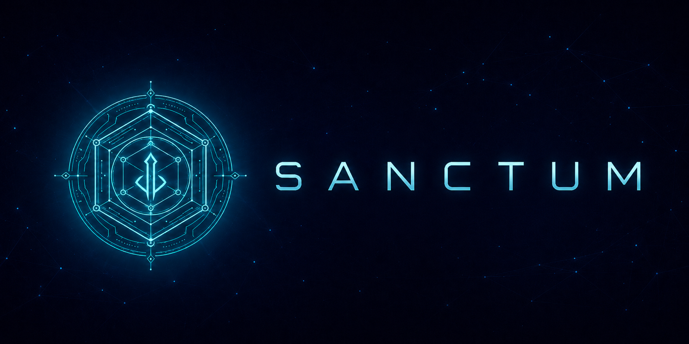

<p align="center">
  
</p>

# Sanctum

Sanctum is a set of hands-on **chambers**: self-contained labs for standing up, testing, and
tearing down modern infrastructure across clouds, hypervisors, and bare metal. Each chamber
is one environment you bring up and destroy on its own; `shared/` holds the reusable platform
pieces they draw on. It is built for practice and prototyping, not as a product.

## Chambers

| Chamber | What it is |
|---------|-----------|
| [`aws-eks`](chambers/aws-eks/) | AWS EKS platform: Terraform + Terragrunt to VPC/EKS/RDS, a full Helm addon layer (Cilium, ArgoCD, observability, security), GitOps delivery, and CI/CD |
| [`kind-kafka`](chambers/kind-kafka/) | Local Kafka on kind + Strimzi (operator via its community Helm chart) |
| [`kind-slo-error-budget`](chambers/kind-slo-error-budget/) | SLO practice on kind: an app with tunable failure, HA Prometheus (kube-prometheus-stack), SLIs, error budgets, and multi-window burn-rate alerts |
| [`kind-istio-mesh`](chambers/kind-istio-mesh/) | Istio service mesh on kind: a v1/v2 app with weighted routing for canary and blue-green releases, and STRICT mutual TLS |
| [`kind-icinga`](chambers/kind-icinga/) | Icinga on kind: the check-and-notify stack (Icinga 2 + Icinga DB + Icinga Web 2) monitoring an app, with a check driven to CRITICAL and a notification, config pushed via the REST API |

Each chamber is self-contained, with its own README covering prerequisites, stand-up,
tear-down, and what it demonstrates. Adding one is additive: a new environment is a new
`chambers/` directory, and nothing else moves.

## Layout

| Path | What it holds |
|------|---------------|
| `chambers/` | One self-contained lab per directory. `aws-eks/` today; more as they land |
| `shared/` | Reusable across chambers: `charts/` (workload Helm charts), `gitops/` (ArgoCD ApplicationSets), `docker/` (images), `redteam/` (Kubernetes security-testing fixtures) |
| `docs/` | Cross-cutting architecture and engineering notes (networking, observability, security, Well-Architected) |
| `scripts/` | Shared Bash: health checks, backups, log rotation |
| `.github/workflows/` | CI/CD with shift-left security gates over keyless OIDC |
| `flake.nix` | Nix-pinned toolchain, reproducible across chambers |

## Shared building blocks

The parts that are identical across Kubernetes chambers live in `shared/`, so labs reference
them instead of copying:

- `shared/charts/podinfo` - the workload chart. podinfo is the standard cloud-native test app;
  its health, readiness, and metrics endpoints are enough to exercise a platform end to end
  (probes, HPA, scraping, SLOs, canary rollouts, admission policies).
- `shared/gitops` - the ArgoCD `AppProject` and `ApplicationSet` that deliver the chart per environment.
- `shared/docker` - the multistage image build (from pinned upstream source) and a hardened Nginx proxy.
- `shared/redteam` - MITRE-mapped attack fixtures and a validation harness for cluster controls.

## Toolchain

```sh
nix develop   # terraform, terragrunt, kubectl, kustomize, helm, hadolint, trivy, cosign, gitleaks, ...
```

## Docs

- `docs/00-scenario.md` - the reference scenario, architecture diagram, naming conventions
- `docs/well-architected.md`, `resilience-auto-recovery.md`, `networking-fundamentals.md` - engineering notes
- `docs/networking-cilium.md` - Cilium eBPF networking, kube-proxy replacement, Hubble
- `docs/devsecops-shift-left.md`, `security-architecture.md` - the security model
- `docs/gitops.md` - GitOps and progressive delivery
- `docs/observability.md` - the four golden signals, RED/USE, signal correlation, SLOs
- `docs/trivy-operator.md` - continuous in-cluster posture (running-image CVE, config/RBAC drift)
