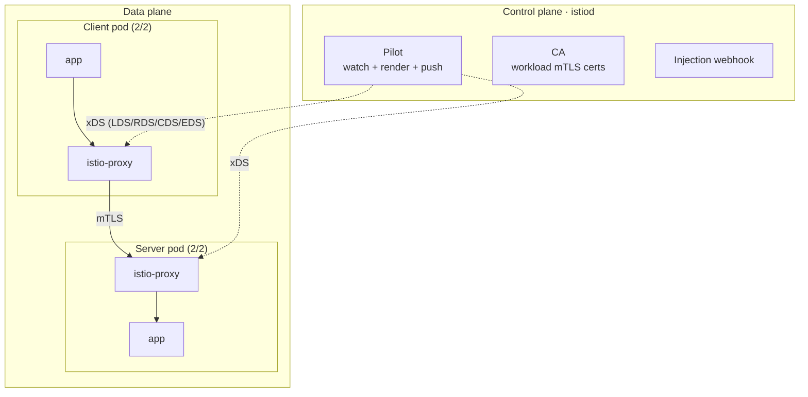
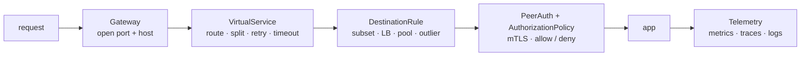

# Istio, end to end

How the mesh in this chamber actually works, from `helm install` to a request
crossing two sidecars with mutual TLS. Grounded in the `web` v1/v2 app, the
weighted `VirtualService`, the STRICT `PeerAuthentication`, and the ingress
gateway defined under `k8s/`.

For a visual version of the CRD catalog, open [`istio-crds.html`](istio-crds.html)
in a browser (a self-contained, offline reference to every custom resource).

## The one idea

A service mesh moves networking concerns (routing, retries, mTLS, telemetry) out
of the application and into a proxy next to every pod. The app makes a plain
`http://web:8080` call; the proxy silently does load balancing, canary weighting,
mutual TLS, and metrics. It is all configured declaratively with CRDs, with no
change to application code.

## Two planes

**Data plane** = the **Envoy** proxies. One `istio-proxy` sidecar runs in every
meshed pod (a `web-v1` pod is `2/2`: the app plus Envoy). All of the pod's inbound
and outbound traffic flows through its Envoy, which terminates and originates
mTLS, applies routing, load balances, retries, and emits telemetry.

**Control plane** = **istiod** (one Deployment in `istio-system`). Three jobs:

1. **Config server (Pilot)**: watches Kubernetes (Services, Endpoints) and the
   Istio CRDs, translates them into Envoy config, and pushes it to every sidecar
   over **xDS** (gRPC).
2. **Certificate Authority**: issues and rotates the mTLS certificates that give
   each workload an identity.
3. **Injection webhook**: mutates pod specs to add the sidecar.

istiod computes config and identity; Envoys enforce it.

## How the sidecar gets there (injection)

Labelling the namespace `istio-injection=enabled` wires up a
**MutatingWebhookConfiguration**. When a pod is created, the API server calls
istiod's webhook, which rewrites the pod spec before scheduling to add:

- an **init container** that sets **iptables** rules in the pod's network
  namespace to redirect all TCP to Envoy (15001 outbound, 15006 inbound), and
- the **`istio-proxy`** sidecar (Envoy plus `pilot-agent`).

That is why `web-v1` is `2/2` and `plain-client` (annotation
`sidecar.istio.io/inject: "false"`) is `1/1`. The iptables redirect is the trick:
the app opens a normal socket, the packets are transparently captured and handed
to Envoy. No app change, no libraries.

(Newer Istio has **ambient mode**, which drops the per-pod sidecar for a per-node
`ztunnel` doing L4 plus mTLS, with optional `waypoint` proxies for L7. Same
control plane, lighter data plane. This chamber uses the classic sidecar model.)

## A request, end to end

`curl web:8080` from a meshed client:

1. The app opens a socket to the `web` Service ClusterIP. iptables redirects it to
   the **client-side Envoy** on 15001.
2. That Envoy already holds config from istiod: the `web` Service, its endpoints
   (v1 and v2 pod IPs), the `DestinationRule` subsets, and the `VirtualService`
   weights. It picks a destination and load balances.
3. The client Envoy **originates mTLS**: presents the client's certificate,
   validates the server's, and opens a mutual-TLS connection to the
   **server-side Envoy** on 15006.
4. The server Envoy checks policy (is mTLS required? `PeerAuthentication STRICT`
   says yes; is the caller allowed? `AuthorizationPolicy` if present), terminates
   TLS, and forwards plaintext to the app on localhost:8080.
5. The app responds; the path reverses; both Envoys emit metrics
   (`istio_requests_total`).

L7 routing happens at the **caller's** Envoy; mTLS and inbound authz at the
**callee's**. Canary weighting is enforced by the client proxy, security by the
server proxy.

## The config resources (what maps to what)

Every Istio CRD is really "generate this Envoy config":

- **Gateway** configures a standalone Envoy (the ingress gateway pod, not a
  sidecar) to accept traffic on a port and host. `web-gw` selects
  `istio: ingressgateway` and opens port 80. It opens the door; it does not route.
- **VirtualService** is the L7 routing: match on host/path/header, then split by
  **weight** across destinations, plus retries, timeouts, fault injection,
  mirroring. The chamber's demos patch this resource.
- **DestinationRule** is what happens after routing picks a service: **subsets**
  (named label selectors, `v1`/`v2`), load balancing, **connection pool** limits,
  and **outlier detection** (circuit breaking).
- **ServiceEntry** adds external services to the mesh registry.
- **Sidecar** scopes which services a namespace's proxies know about (a real
  scaling lever).
- **PeerAuthentication** sets workload mTLS mode (`STRICT`/`PERMISSIVE`/`DISABLE`).
- **AuthorizationPolicy** is L7 authz (allow/deny by identity, namespace, method,
  path); **RequestAuthentication** validates end-user JWTs.

Mental split: **VirtualService = routing, DestinationRule = the pool/policy of
what you routed to, Gateway = the edge, Peer/AuthorizationPolicy = security.**

## The full CRD catalog

**Traffic management** (`networking.istio.io`)

| CRD | Purpose | Key abilities | Acts at |
|-----|---------|---------------|---------|
| `Gateway` | Open ports/hosts on the edge Envoy | ports, TLS termination, host/SNI | edge gateway |
| `VirtualService` | L7 routing rulebook | weight split, retries, timeouts, fault, mirror, rewrite | client proxy + gateway |
| `DestinationRule` | Policy for the chosen destination | subsets, load balancing, connection pool, outlier detection, upstream TLS | client proxy |
| `ServiceEntry` | Add external services to the registry | register hosts, egress control | mesh registry |
| `Sidecar` | Scope a proxy's config and egress | limit config, egress hosts, cut proxy memory | per ns/workload |
| `WorkloadEntry` | Register a VM as a mesh endpoint | non-pod identity + endpoint | mesh registry |
| `WorkloadGroup` | Template that auto-registers VMs | VM autoregistration, health probes | mesh registry |
| `EnvoyFilter` | Patch raw Envoy config (escape hatch) | custom filters, low-level tuning | any proxy |
| `ProxyConfig` | Proxy runtime settings | concurrency, image, env | proxy runtime |

**Security** (`security.istio.io`)

| CRD | Purpose | Key abilities | Acts at |
|-----|---------|---------------|---------|
| `PeerAuthentication` | Workload mTLS mode | STRICT / PERMISSIVE / DISABLE, per-port | server proxy |
| `RequestAuthentication` | Validate end-user JWTs | JWKS/issuer, expose claims | server proxy (L7) |
| `AuthorizationPolicy` | Allow/deny who calls what | ALLOW/DENY by identity, claim, method, path; CUSTOM ext-authz | server proxy |

**Telemetry and extensibility** (`telemetry.istio.io`, `extensions.istio.io`)

| CRD | Purpose | Key abilities | Acts at |
|-----|---------|---------------|---------|
| `Telemetry` | Shape metrics/traces/logs | trace sampling, metric overrides, access logs, provider select | any proxy |
| `WasmPlugin` | Load a Wasm filter into proxies | custom L7 logic, OCI modules, phase ordering | any proxy |

## Traffic management the app never sees

All of these are `VirtualService`/`DestinationRule` config, demonstrated by the
chamber's tasks:

- **Canary** (`task canary`): shift a small weight to v2, watch, ramp. Requests
  are split; a fraction of live users hit the new version.
- **Blue-green** (`task bluegreen`): both versions deployed; flip 100% in one
  step; instant rollback. Decoupled from deploys, so a rollback is a one-line
  weight change.
- **Fault injection** (`task fault`): Envoy returns errors or delays for a
  percentage of requests without the app being called, to test caller behaviour.
- **Timeouts and retries** (`task resilience`): a route timeout caps latency; a
  retry policy masks transient upstream failures. Reliability the app did not
  implement.
- **Circuit breaking** (`task circuit`): a tight `connectionPool` sheds overflow
  with 503 rather than piling onto an overwhelmed backend; `outlierDetection`
  ejects unhealthy endpoints.
- **Mirroring** (`task mirror`): shadow live traffic to v2 while users still get
  v1, to test the new version with real load and zero user impact.

## mTLS mechanics

- Each workload gets a **SPIFFE identity** from its ServiceAccount, e.g.
  `spiffe://cluster.local/ns/web/sa/default`, as the certificate SAN.
- The `pilot-agent` requests a cert from istiod's CA at startup and **rotates it
  every ~24h**. No cert files, no manual PKI.
- **STRICT** means the server only accepts mTLS. A plaintext client with no cert
  is reset (the `HTTP 000` in `task mtls-demo`). **PERMISSIVE** (the default)
  accepts both, which is how you migrate a live system to mTLS without downtime:
  inject sidecars everywhere in PERMISSIVE, confirm all traffic is mTLS, then flip
  to STRICT.
- STRICT would break kubelet's plaintext health probe, so Istio **rewrites
  probes** through the agent on 15020, which is why readiness still passes.

## xDS: how config actually ships

istiod is an **xDS server** (Envoy's discovery protocol over gRPC). Each Envoy
subscribes and receives Listeners (LDS), Routes (RDS, from VirtualServices),
Clusters (CDS, a service plus subset), and Endpoints (EDS, the live pod IPs). When
you `kubectl patch` the VirtualService weights, istiod recomputes the route config
and pushes RDS to the relevant Envoys within a second, no restarts. That
push-based incremental model is why traffic shifts are instant and safe.

## Observability, for free

Because every request crosses Envoys, you get, without touching the app:

- **Metrics**: `istio_requests_total`, `istio_request_duration_milliseconds`
  labelled by source, destination, response code, and version. Scrape these with
  Prometheus for per-service golden signals and a real basis for SLOs.
- **Distributed traces**: Envoy propagates trace headers to Jaeger/Tempo.
- **Kiali**: reads the mesh config plus Prometheus metrics to draw the live
  service graph.

## The install this chamber runs

`task istio` does three Helm charts in order, because of dependencies:

1. **`base`** installs the CRDs and cluster-wide RBAC (`defaultRevision=default`
   wires the validating webhook).
2. **`istiod`** is the control plane (Pilot, CA, injection webhook).
3. **`gateway`** is the standalone ingress Envoy, exposed as a NodePort mapped to
   host `18081`.

Labelling namespace `web` turns on injection; applying `app.yaml`, `routing.yaml`,
and `mtls.yaml` gives istiod the CRDs to translate into Envoy config.

## The one-paragraph version

Istio puts an Envoy proxy beside every pod (injected by a mutating webhook,
traffic captured by iptables) and runs istiod as the control plane that watches
Kubernetes plus your CRDs, mints per-workload SPIFFE certs, and pushes Envoy
config over xDS. The app makes plain calls; the client-side Envoy does routing and
originates mTLS, the server-side Envoy enforces mTLS and authz. `VirtualService`
weights over `DestinationRule` subsets give canary and blue-green as pure config,
decoupled from deploys; the same VirtualService/DestinationRule do fault
injection, retries, timeouts, circuit breaking, and mirroring; `PeerAuthentication
STRICT` gives zero-trust mTLS with auto-rotating certs; and every hop emits
metrics you can build SLOs against. Everything is declarative CRDs that istiod
compiles into Envoy.
